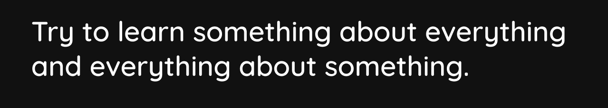

# Hi I'm Anuj Rana.

> I'm passionate about Machine Learning (more in Deep Learning). My journey in Machine Learning starts in 2018, when I first made a project , and now I'm experiences in Pytorch and TensorFlow. I really like JARVIS from Iron Man when I was in 10th standard, from then I wanted to build him (not it). So now I'm currently studying NLP and speech Recognition.

## Projects

### Basic

- 
- 

### Computer Vision

- 
- 

### Natural Language Processing

- 
- 

## Learning

### Machine Learning using Sklrearn

- 
- 

### Pytorch

- 
- 

### TensorFlow

- 
- 

### Deployment

- 
- 

